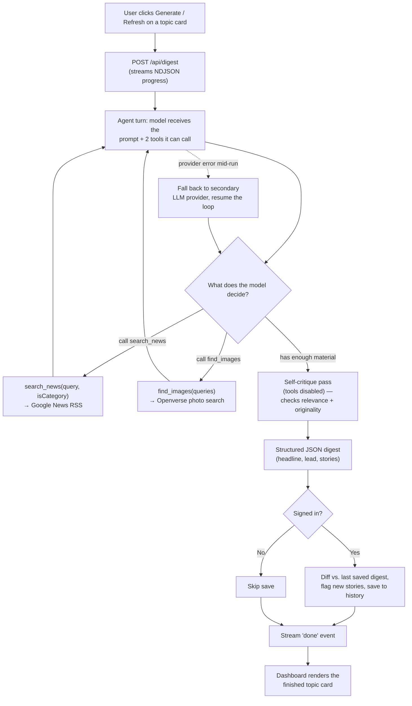

# The AI Briefing

**An autonomous news-research agent that reads the internet so you don't have to.**

Sign in, tell it what you care about — a fixed category like Technology or a
free-text topic like "lunar missions" — and an AI agent independently
searches for current headlines, sources a real photo for each story,
fact-checks and rewrites its own draft, and hands back a synthesized "front
page" digest. No human curates the sources, no fixed pipeline decides how
many searches to run — the model does.

## Purpose

Most "AI news" products are a thin prompt wrapped around a single LLM call:
paste in some headlines, ask for a summary. That's fast, but it's not
research — the model only ever sees what a human (or a rigid script) chose
to hand it.

This project asks a different question: **what happens if you give the
model the tools and let it decide how to use them?** Instead of "summarize
these 10 headlines," the agent is told "produce a digest on this topic" and
given two tools — search and image lookup — with no fixed call count. It
decides how many searches are enough, whether to broaden a thin search,
which stories are worth publishing, and whether its own first draft is
actually good enough to ship.

## Outcomes

- **A dashboard, not a feed** — every topic you follow renders as its own
  self-contained card: a synthesized headline, a lead paragraph tying the
  coverage together, and every underlying story with its own photo and
  one-line "why this matters," rather than a raw list of links.
- **Original writing, not scraped copy** — the agent is explicitly required
  to paraphrase; a self-critique pass checks its own draft for verbatim
  copying and off-topic drift before anything is shown to the user.
- **A live paper trail** — you watch the agent work in real time ("Searching
  'lunar missions'…", "Sourcing photos for 6 stories…", "Double-checking
  relevance and originality…") instead of staring at a spinner.
- **Memory across visits** — digests are diffed against your last saved
  version per topic, so returning stories are quiet and genuinely new ones
  are flagged, the same way a real news app tells you what changed since
  you last looked.
- **Resilience by design** — if the primary model provider errors out
  mid-run, the agent transparently retries the whole task on a second
  provider rather than failing the request in front of the user.

## How the agent actually works

This isn't a fixed pipeline (`fetch → summarize → done`) — it's a loop where
the model itself is in control of each step, and the whole run streams to
the browser live as it happens.



**Step by step:**

1. **Prompted, not scripted.** The model gets a single instruction — "produce
   a digest on this topic" — plus two tool definitions. It is never told how
   many times to search.
2. **Autonomous, adaptive searching.** For a fixed category, one search is
   enough. For an open-ended topic, the model can issue up to three searches
   with different phrasings to triangulate coverage, and if results are
   still thin, it can broaden to the closest fixed category on its own
   judgment — clearly disclosing that in the digest rather than silently
   padding it.
3. **Tool execution is real, not simulated.** `search_news` hits live Google
   News RSS; `find_images` hits Openverse (Creative Commons / public-domain
   photography). Every tool call and its result streams to the client
   immediately as a progress event — this is what powers the live trace UI.
4. **The model decides when it's done.** Once it has picked the stories it
   intends to publish, it calls the image tool exactly once, then stops
   calling tools and writes its draft.
5. **Self-critique before publishing.** The draft isn't accepted on sight —
   one more turn (tools disabled, so it can't keep stalling by searching
   more) asks the model to check its own work against two hard rules: does
   every story actually belong to the topic, and is everything paraphrased
   rather than copied. It either returns the draft unchanged or corrects it.
6. **Provider fallback, mid-task.** If the primary provider (Gemini) errors
   out during the run, the same tool-calling loop is replayed against a
   second provider (Groq) rather than surfacing a failure — the user sees a
   brief "switching providers" trace line, not an error page.
7. **Personalized memory.** For signed-in users, the finished digest is
   compared against that same topic's last saved run; stories whose link
   wasn't seen before get flagged "NEW" on the dashboard.

The whole loop lives in `lib/agent.js` (Gemini) and `lib/providers/groq.js`
(fallback), sharing prompts and tool execution via `lib/agentShared.js`.
`app/api/digest/route.js` wraps it in a streamed NDJSON response; the
dashboard reads that stream directly and renders progress as it arrives.

## Strengths

- **Genuinely agentic, not a chatbot with a search button** — the model
  controls branching (how many searches, whether to broaden, when it's
  done), not application code. Two different providers implement the exact
  same decision loop, proving the behavior is a property of the prompt/tool
  design, not one model's quirks.
- **Self-correction built into the pipeline** — a dedicated critique turn
  with tools deliberately disabled, so the model can't dodge the check by
  just searching more. Quality control is part of the agent, not a
  human-in-the-loop step bolted on afterward.
- **Zero scraping, zero fragile HTML parsing** — both tools call structured,
  public data sources (RSS, a photo search API), so the agent never depends
  on a news site's markup staying stable.
- **Provider-agnostic core** — prompts and tool execution are written once
  in `lib/agentShared.js` and reused by both LLM providers, so swapping or
  adding a model is a new thin adapter, not a rewrite.
- **Real-time observability** — every tool call, retry, and provider switch
  is a typed event streamed to the browser, so a user (or a developer
  debugging a run) sees exactly what the agent is doing and why, live.
- **Security-conscious by default** — Supabase Row Level Security means a
  user's bookmarks and digest history are enforced as private at the
  database layer, not just hidden in the UI.
- **Designed for a real reading experience** — light/dark theming, ordered
  topics, skeleton loading states, and "what's new since last time" diffing
  are all in service of this reading like an actual news product, not a
  demo of an API call.

## Tech stack

| Layer | Choice |
|---|---|
| Framework | Next.js 14 (App Router), React 18 |
| Primary LLM | Google Gemini (`gemini-3.6-flash`) via `@google/genai`, native function calling |
| Fallback LLM | Groq (`openai/gpt-oss-20b`), OpenAI-compatible tool calling |
| News source | Google News RSS (`rss-parser`) — no API key |
| Image source | Openverse — free, keyless Creative Commons / public-domain photo search |
| Auth + storage | Supabase (`@supabase/ssr`) — Google OAuth, Postgres with Row Level Security |
| Styling | Tailwind CSS, CSS-variable-driven light/dark theming |

## Project structure

```
app/
  page.jsx                 redirects signed-in → /dashboard, else → /signin
  signin/page.jsx           Google sign-in
  dashboard/page.jsx         one card per followed topic, live digest generation
  settings/page.jsx          follow/unfollow categories + custom topics, reorder
  components/
    TopicDigestCard.jsx      renders one topic's digest + its story cards
    NewsCards.jsx             story card UI + client-side digest streaming
    ThemeToggle.jsx           light/dark theme switch
  api/
    digest/route.js          runs the agent loop, streams NDJSON progress
    digest/latest/route.js    fetches a topic's last cached digest
    bookmarks/route.js        follow/unfollow/reorder topics
lib/
  agent.js                  Gemini agent loop + Gemini→Groq fallback
  providers/groq.js          Groq agent loop (mirrors agent.js)
  agentShared.js             shared prompts, JSON parsing, tool dispatch
  news.js                    Google News RSS tool implementation
  images.js                  Openverse tool implementation
  theme.js                   shared design tokens
  supabase/                  browser + server Supabase clients
supabase/schema.sql          bookmarks + digest_history tables, RLS policies
```

## Getting started

### 1. LLM provider keys
- Create a Gemini API key at https://aistudio.google.com/apikey and set it
  as `GEMINI_API_KEY`.
- Optionally create a Groq key at https://console.groq.com/keys and set it
  as `GROQ_API_KEY` — enables automatic fallback if Gemini errors out
  mid-run (see `lib/providers/groq.js`).

### 2. Supabase project (auth + storage)
1. Create a project at https://supabase.com.
2. **Settings → API** → copy the **Project URL** and the **publishable /
   anon** key (never the `secret` / `service_role` key into the app).
3. Run `supabase/schema.sql` once in **SQL Editor → New query** — creates
   the `bookmarks` and `digest_history` tables with Row Level Security.

### 3. Google Sign-In (configured in Supabase, not in app code)
1. Google Cloud Console → **APIs & Services → OAuth consent screen** →
   External → app name + your email.
2. **Credentials → Create Credentials → OAuth client ID** → Web application
   → Authorized redirect URI: `https://<your-project-ref>.supabase.co/auth/v1/callback`.
3. Supabase → **Authentication → Providers → Google** → paste the Client ID
   and Secret from step 2.
4. Supabase → **Authentication → URL Configuration** → set your Site URL
   and add it (with `/**`) under Redirect URLs.

### 4. Environment and run
```bash
cp .env.example .env.local
# fill in GEMINI_API_KEY, GROQ_API_KEY (optional),
# NEXT_PUBLIC_SUPABASE_URL, NEXT_PUBLIC_SUPABASE_ANON_KEY

npm install
npm run dev
```
Open the app, sign in with Google, and pick your topics on `/settings`.

## Feature highlights

- **Live agent trace** — real-time progress line above each loading card
  ("Searching…", "Sourcing photos…", "Double-checking relevance…").
- **Reading-length control** — Quick Brief / Standard / Deep Dive is
  supported end-to-end (`storyCount` in `lib/agent.js`); wiring a UI toggle
  for it on the dashboard is the natural next step.
- **Topic ordering** — drag topics into priority order on `/settings`,
  persisted per user.
- **"What's new" diffing** — stories not present in your last saved digest
  for that topic are flagged `NEW`.
- **Light / dark theme** — a full CSS-variable design system, toggled and
  persisted per browser.

## Possible extensions

- A UI control for reading length per card (backend already supports it).
- Let the agent decide *which* category best fits an ambiguous free-text
  topic, instead of the UI fixing category vs. free-text up front.
- A third tool (e.g. `fetch_article_summary(url)`) letting the agent pull a
  fuller excerpt for a story it judges under-explained — a drop-in third
  branch in `executeToolCall`.
- Let the self-critique pass re-invoke `search_news` to actually replace a
  flagged story, instead of only flagging it.
