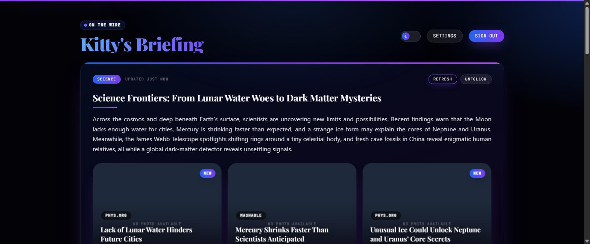
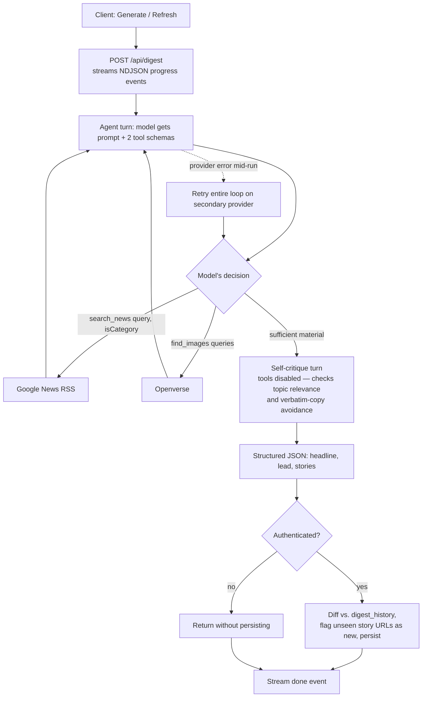
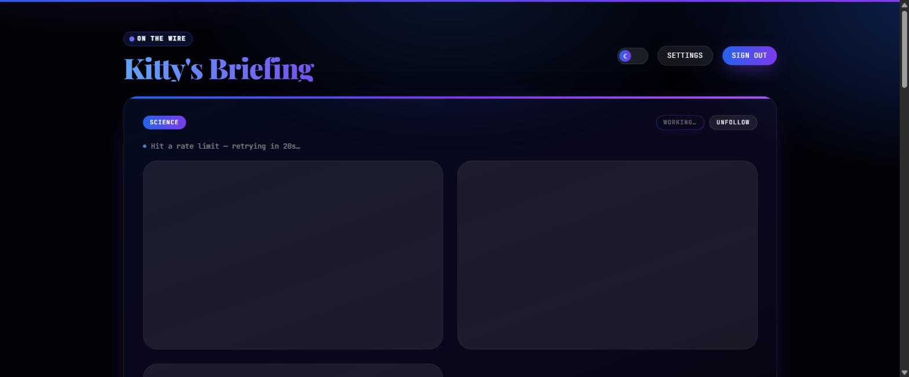
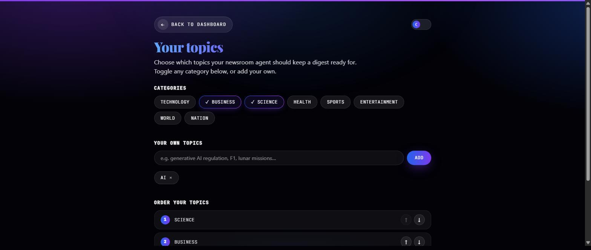

# The AI Briefing

A news-digest app built around a tool-calling LLM agent: given a topic, the
model autonomously decides how many searches to run, when to broaden scope,
which stories to publish, and whether its own draft passes a relevance/
originality check — before any output reaches the user.



## Problem statement

A single-call "summarize these headlines" pattern requires the caller to
already know what to fetch, how much, and when it's enough. This project
instead gives the model two tools and a goal, and lets it control the
loop: search depth, scope-broadening, and stopping condition are all model
decisions, not caller-supplied parameters. The same architecture is
duplicated across two independent LLM providers (Gemini native function
calling, Groq's OpenAI-compatible tool calling) to keep the design honest —
if the control flow only works because of one model's quirks, it isn't a
real pattern.

## Agent architecture



**Contract between prompt and code** (`lib/agentShared.js`):

- `search_news(query, isCategory)` — one call for a fixed category; up to 3
  calls with varied phrasing for a free-text topic; one further fallback
  call against the closest fixed category if coverage is still thin
  (disclosed in the output, not silently blended in). Executes against
  Google News RSS (`lib/news.js`) — no scraping, no API key.
- `find_images(queries)` — exactly one call, made only after story
  selection, one short visual-concept phrase per story. Executes against
  Openverse (`lib/images.js`) — Creative Commons / public-domain search, no
  API key. A `null` result per phrase is expected behavior, not an error.
- Every tool call/result is emitted as a typed event through the `onEvent`
  callback and streamed to the client as NDJSON — this is the live trace
  in the screenshot below, not a synthetic loading message.
- Turns are capped (`maxTurns = 8`) to bound a runaway tool-calling loop;
  hitting the cap without a final answer surfaces as a explicit error
  rather than an infinite hang.
- The self-critique turn runs with `tools` omitted from the request —
  forcing a judgment on the existing draft instead of deferring by
  searching again.
- `runDigestAgent` (`lib/agent.js`) tries Gemini first; on
  `RESOURCE_EXHAUSTED` specifically (not any error) with `GROQ_API_KEY`
  configured, it replays the identical prompt/tool contract against Groq
  (`lib/providers/groq.js`). Both loops share `buildInitialPrompt`,
  `buildSelfCritiquePrompt`, and `executeToolCall` — provider adapters
  differ only in request/response shape, never in agent logic.



## Data flow and persistence

- Auth + row-level data isolation via Supabase (`@supabase/ssr`); Google
  OAuth handled entirely by Supabase's server-side exchange, not app code.
- `bookmarks` table drives what the dashboard renders — followed
  categories, free-text topics, and their display order
  (`app/api/bookmarks/route.js`).
- `digest_history` stores the last generated digest per `(user, topic)`.
  Each new run is diffed against it by story URL; unseen URLs are flagged
  `isNew` and rendered as a badge — see the `dashboard.jpg` screenshot
  above for a followed topic mid-diff.
- RLS policies scope every row to `auth.uid()` — enforced at the database
  layer, independent of any app-layer check (`supabase/schema.sql`).



## Stack

| Layer | Choice | Why |
|---|---|---|
| Framework | Next.js 14 App Router, React 18 | Streaming responses via `ReadableStream` for the agent's NDJSON trace |
| Primary LLM | Gemini (`gemini-3.6-flash`), `@google/genai` | Native function-calling, low latency |
| Fallback LLM | Groq (`openai/gpt-oss-20b`) | OpenAI-compatible tool calling, independent quota, used to prove provider-agnostic agent design |
| News retrieval | Google News RSS via `rss-parser` | Structured feed, no scraping surface to maintain |
| Image retrieval | Openverse | Keyless CC/public-domain search |
| Auth + storage | Supabase (`@supabase/ssr`) | OAuth handled server-side, Postgres RLS for per-user isolation |
| Styling | Tailwind CSS, CSS custom properties | Theme is entirely data-attribute + variable driven — no per-component light/dark branching |

## Repo layout

```
app/
  api/digest/route.js         runs the agent loop, streams NDJSON
  api/digest/latest/route.js  returns a topic's last cached digest
  api/bookmarks/route.js      follow / unfollow / reorder topics
  dashboard/page.jsx           one card per followed topic
  settings/page.jsx            follow state + custom topics + ordering
  components/TopicDigestCard.jsx
  components/NewsCards.jsx     story cards + client-side digest streaming
lib/
  agent.js                    Gemini loop + provider fallback dispatch
  providers/groq.js            Groq loop (same contract, different wire format)
  agentShared.js               shared prompts, tool dispatch, JSON parsing
  news.js / images.js          tool implementations
  supabase/                    browser + server Supabase clients
supabase/schema.sql            bookmarks + digest_history schema, RLS policies
```

## Running locally

```bash
cp .env.example .env.local
# GEMINI_API_KEY, GROQ_API_KEY (optional fallback), NEXT_PUBLIC_SUPABASE_URL,
# NEXT_PUBLIC_SUPABASE_ANON_KEY
npm install
npm run dev
```

Supabase project needs `supabase/schema.sql` applied once (SQL Editor), and
Google OAuth configured under **Authentication → Providers** with the
redirect URI registered in Google Cloud Console pointing at Supabase's own
callback endpoint — not this app's domain.

## Known limitations

- **Provider fallback restarts the tool-calling loop from scratch** — Groq
  doesn't inherit Gemini's partial conversation, so a mid-run switch
  re-executes `search_news`/`find_images` rather than resuming with
  already-fetched results. Functionally correct, but wastes a full
  duplicate round-trip and eats into the fallback provider's own token
  budget right as it's needed most.
- **Tool failures degrade silently** — `executeToolCall` catches RSS/image
  fetch errors and returns an empty result rather than propagating the
  failure, so the model (and the trace) can't distinguish "genuinely no
  results" from "the upstream source errored."
- **Image relevance is conceptual, not event-specific** — Openverse is
  queried by visual subject (e.g. "offshore wind turbine"), not the actual
  news event, since it indexes stock-style concepts, not headlines.
- Gemini's `contents` API has had cross-version inconsistency in whether a
  tool result is `role: "user"` or `role: "function"`; this code uses
  `role: "user"` with a `functionResponse` part, which is what
  `gemini-3.6-flash` currently expects.

## Possible extensions

- Carry Gemini's fetched tool results into the Groq fallback conversation
  instead of re-executing them — directly addresses the limitation above.
- Surface tool-execution errors as a distinct trace event, separate from
  "zero results," so failures are diagnosable from the live trace alone.
- A third tool (e.g. `fetch_article_summary(url)`) for a story the model
  judges under-explained — drops into `executeToolCall` as a new branch.
- Let the self-critique turn re-invoke `search_news` to replace a flagged
  story instead of only flagging it, at the cost of an unbounded extra turn.
